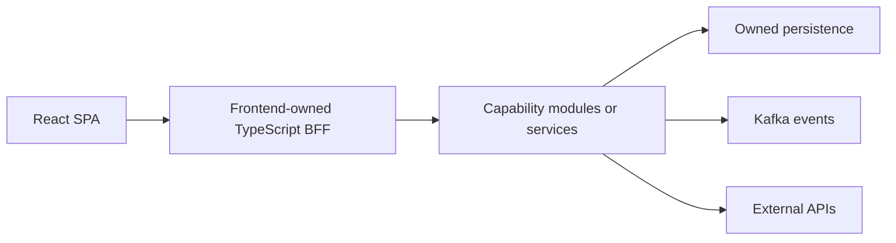

# Architecture

## Mission and limits

A developer clones the product template, runs a single bootstrap workflow after documented prerequisites, and reaches a working browser → BFF → capability → persistence slice with observability, tests, and CI. Native tools remain authoritative; root commands orchestrate them. Generated services are operable, contracts are versioned and validated, and examples and docs evolve together.

Release one is not a generic internal developer platform or Kubernetes abstraction. Avoid services for every noun, domain rules in BFFs, forced identical language internals, and a separate wiki. Support modular monoliths and deliberate extraction under the same external conventions.

Browser business API traffic goes through the BFF; capability services own data and domain events. Static asset and telemetry transport are separate implementation choices, not permission to bypass the BFF for business APIs.

## Invariants

| ID | Rule | Intended enforcement/evidence |
| --- | --- | --- |
| ARC-01 | Frontends call their BFF, not internal services. | Network controls, generated-client boundary, architecture test |
| ARC-02 | BFFs aggregate and reshape; capabilities own core domain rules. | Review and module boundary tests |
| ARC-03 | Services align to business capabilities. | ADR for each new service with extraction rationale |
| ARC-04 | Services own persistence and migrations; no other service's tables. | Credentials/schema ownership and integration checks |
| ARC-05 | Synchronous calls serve a current request; events state a past fact. | API/event design review |
| ARC-06 | Contract, domain, persistence, and event models are separate concerns. | Explicit mappings and compatibility tests |
| ARC-07 | Deployed components are observable and operable by default. | Health, logs, metrics, traces, dashboards, alerts |
| ARC-08 | Executable examples and documentation change in the same PR. | Docs checks, ownership and PR checklist |

Enforcement entries are requirements for adopting products, not claims that checks exist here.

## Service boundaries

Keep a capability as a module when the same team releases it together, traffic/reliability needs match, cross-boundary transactions are frequent, or the boundary is still being discovered. Extract when concrete ownership, release independence, scale, reliability, data isolation, or security needs justify deployment independence. Own data and make consistency semantics explicit before extraction. Record the reason and consequences in a project ADR.

## BFF boundary

Each frontend owns one logical BFF. It owns session translation, frontend-specific authorization checks, aggregation, response shaping, feature flags, correlation, timeout/retry policies, cache hints, and error mapping. It does not own canonical business rules, another service's database, reusable domain workflows, durable event truth, or unrelated consumers' generic APIs. Capability authorization remains authoritative.

Route flow: validate → authorize → orchestrate → map → respond. Parallelize independent downstream calls. Every call has a timeout, cancellation propagation, and deliberate retries. Propagate trace context and request ID; return request ID in problem responses. Expose OpenAPI for the browser client. Use RFC 9457-style problem details or an equivalently stable error envelope.

## Decisions and authority

Agents may choose file-level details, small compatible libraries, internal naming, fixtures, and minor script UX within authorized scope. New deployable boundaries, infrastructure, authentication models, contract breaks, security trade-offs, and changes to defaults or invariants need a recorded project decision; ask the owner where a material choice is unresolved. Existing authorization remains valid. An ADR records a decision; it does not grant permission for deployment or other external actions.

Use the [ADR template](knowledge-base.md#adr-template), [contract rules](contracts-and-data.md), and [operations baseline](operations.md) when a boundary changes.
